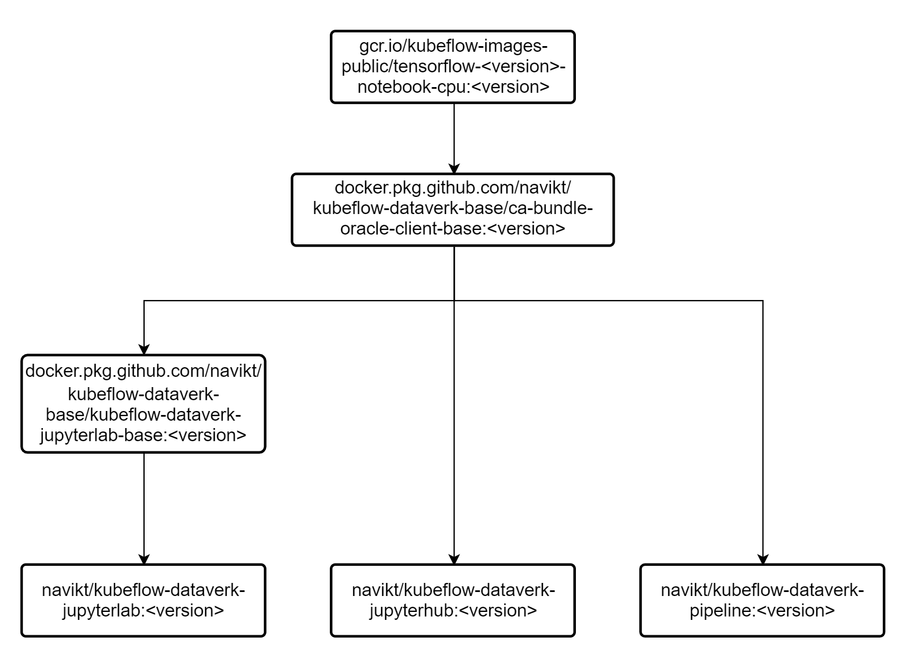

# kubeflow-dataverk-base
Base docker images for notebook servers i kubeflow. 

Det finnes tre ulike imager:
1. navikt/kubeflow-dataverk-jupyterhub:<tag>
    - kubeflow image med jupyterhub miljø
2. navikt/kubeflow-dataverk-jupyterlab:<tag>
    - kubeflow image med jupyterlab miljø
3. navikt/kubeflow-dataverk-pipeline
    - kubeflow image for å kjøre jupyter notebooks som en kubeflow pipeline

# Legge til pakker
Dersom det ønskes nye python pakker inn i baseimagene så kan man lage en pull request til dette repoet med ønsket pakke lagt til i requirements.txt
